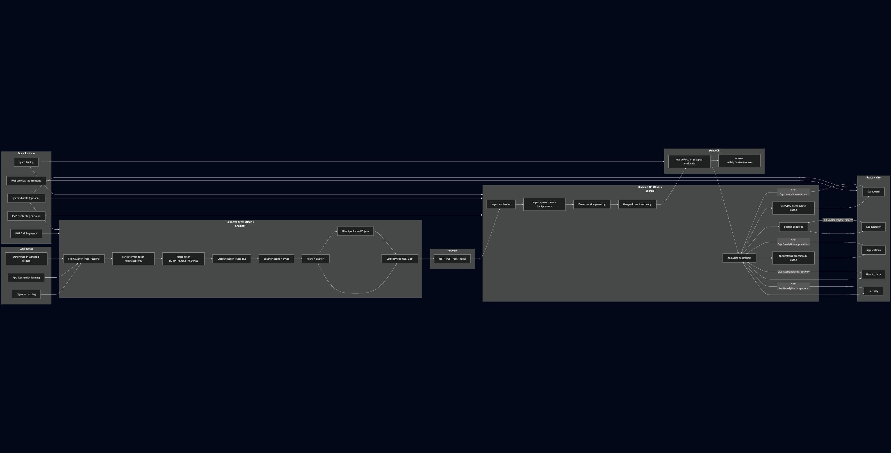

# Centralized Log Monitoring System

A full-stack platform for ingesting, parsing, and exploring logs from distributed applications and web servers (Nginx). The system provides real-time ingestion, fast search, and analytics dashboards to track traffic, user activity, and anomalies.

## Highlights

- **Real-time ingestion**: Lightweight agents tail logs and stream them to the backend.
- **Strict format parsing**: Accepts only well-formed nginx combined logs and your app log format.
- **Fast analytics**: Precomputed overview stats reduce UI lag (overview defaults to 24h; longer ranges warm in background).
- **Explorer + filters**: Full-text search plus structured filters (IP, UID, course, status, source, app, VM, time range).
- **Multi-VM ready**: Agent is portable and configurable per VM.

## Architecture

- **Agent** (Node.js + Chokidar): watches log files/folders, filters, batches, and sends logs.
- **Backend** (Node.js + Express + MongoDB): parses, stores, and serves analytics/search APIs.
- **Frontend** (React + Vite + Recharts): dashboard and log explorer.

## Architecture Diagram 



## Quick Start

1. **Make the start script executable**
   ```bash
   chmod +x start-all.sh
   ```
2. **Run the stack** (ensure MongoDB is running)
   ```bash
   ./start-all.sh
   ```
   This script:
   - Installs dependencies (backend, frontend, agent)
   - Starts backend API on `http://localhost:5002`
   - Starts frontend on `http://localhost:5173`
   - Starts the agent
3. **Open the dashboard**
   ```text
   http://localhost:5173
   ```

Optional clean start:
```bash
RESET_DB=1 ./start-all.sh
```

## Log Formats Accepted (Strict)

Only these two formats are ingested. Everything else is rejected at the agent.

**1) Nginx combined**
```
49.37.223.210 - - [28/Jan/2026:00:00:10 +0000] "POST /studentapi/see908q32526/lectures/12/analytics HTTP/1.1" 200 63 "https://..." "Mozilla/5.0 ..."
```

**2) App log format**
```
[2026-01-22T00:04:43.874Z]  POST  200  /quizzes/take/1  62146  ee966q32526  174.230.185.2  [155.586 ms]  Mozilla/5.0 ...
```
Where:
- `uid` = `62146`
- `course` = `ee966q32526`

## Project Structure

```
├── agent/              # Log Collector Agent
│   ├── collector.js    # Main agent logic
│   └── .env            # Agent configuration
├── backend/            # Central API & Parsing Logic
│   ├── server.js       # Entry point
│   ├── models/         # MongoDB models
│   └── controllers/    # API Controllers (Ingest, Analytics)
├── frontend/           # React Dashboard
│   ├── src/pages/      # Dashboard Views (Overview, Explorer, etc.)
│   └── src/components/ # Reusable UI components
└── start-all.sh        # Helper script to launch everything
```

## Configuration

### Backend environment (`backend/.env`)
```
PORT=5002
HOST=0.0.0.0
MONGO_URI=mongodb://localhost:27017/log-monitoring
JSON_BODY_LIMIT=10mb
OVERVIEW_PRECOMPUTE_MS=5000
APPLICATIONS_PRECOMPUTE_MS=10000
MONGO_MAX_POOL_SIZE=50
MONGO_MIN_POOL_SIZE=5
MONGO_AUTO_INDEX=1
MONGO_CAP_BYTES=53687091200
HTTP_KEEPALIVE_TIMEOUT_MS=60000
HTTP_HEADERS_TIMEOUT_MS=65000
HTTP_REQUEST_TIMEOUT_MS=120000
INGEST_BATCH_SIZE=2000
INGEST_MAX_BYTES=5242880
INGEST_QUEUE_MAX=200000
INGEST_QUEUE_MAX_BYTES=209715200
INGEST_FLUSH_INTERVAL_MS=200
INGEST_RETRY_BASE_MS=500
INGEST_RETRY_MAX_MS=10000
INGEST_RETRY_JITTER_MS=200
```

### Frontend environment (`frontend/.env`)
```
VITE_API_BASE_URL=http://<BACKEND_HOST>:5002
VITE_DASHBOARD_REFRESH_MS=5000
VITE_APPLICATIONS_REFRESH_MS=10000
```

### Agent environment (`agent/.env`)
```
BACKEND_URL=http://<BACKEND_HOST>:5002/api/ingest
LOG_FILES=/var/log/nginx/access.log,/var/log/my-app.log
APP_NAME=Central-VM
VM_ID=vm-01
BATCH_SIZE=1000
FLUSH_INTERVAL_MS=500
TAIL_FROM_END=0
USE_POLLING=0

# Resume offsets (restart-safe)
STATE_FILE=.offsets.json
RESET_OFFSETS=0
READ_NEW_FILES_FROM_START=1

# Filter nginx routes
NGINX_REJECT_PREFIXES=/studentapi,/api

# Payload sizing / compression
MAX_BATCH_BYTES=1000000
USE_GZIP=1

# Reliability / buffering
MAX_BUFFER_ITEMS=20000
MAX_BUFFER_BYTES=20000000
ENABLE_SPOOL=1
SPOOL_DIR=spool
MAX_SPOOL_BYTES=209715200
RETRY_BASE_MS=1000
RETRY_MAX_MS=30000
RETRY_JITTER_MS=250
HTTP_TIMEOUT_MS=10000
```

## Log Explorer

- **Course filter**: matches `parsedData.course` (supports partial matches).
- **Course column**: visible in the table and clickable for quick filtering.
- **Full-text search**: searches URL/message/raw text.

## Multi-VM Setup

1. Copy the `agent/` folder to each VM.
2. Set `BACKEND_URL`, `VM_ID`, `APP_NAME`, and `LOG_FILES` on each VM.
3. Start the agent:
   ```bash
   node collector.js
   ```

## Reset Everything (DB + Offsets)

To clear all logs and re-ingest from scratch:

```bash
node backend/scripts/reset-db.js
RESET_OFFSETS=1 node agent/collector.js
```

Note: `MONGO_CAP_BYTES` (capped collection) only applies when the collection is created.
For a fresh start, drop the database before enabling capped storage.

## Performance / Production Notes

**Backend**
- Uses precomputed overview stats on a timer (`OVERVIEW_PRECOMPUTE_MS`).
- Uses MongoDB connection pooling (`MONGO_MAX_POOL_SIZE`, `MONGO_MIN_POOL_SIZE`).
- Accepts larger JSON payloads (`JSON_BODY_LIMIT`).
- Supports capped log storage (`MONGO_CAP_BYTES`) for size-based retention.

**Agent**
- Byte-capped batching (`MAX_BATCH_BYTES`) to avoid oversized requests.
- Optional gzip (`USE_GZIP=1`) to reduce payload size.
- Offset tracking to resume without re-ingesting old logs.
- Disk spooling (`ENABLE_SPOOL=1`) to survive backend/network outages.

**Recommended production practices**
- Run backend with a process manager (e.g., PM2 cluster mode).
- Put MongoDB on dedicated SSD/NVMe storage.
- Tune OS limits (ulimit, TCP backlog) for high ingest.

## Production Ops (PM2, systemd, sysctl)

We include production helpers under `ops/`.

### PM2 (multi-core backend)
```bash
npm install -g pm2
pm2 start ops/pm2/ecosystem.config.cjs
pm2 save
pm2 startup
```

### systemd (auto-restart on boot)
```bash
sudo cp ops/systemd/log-backend.service /etc/systemd/system/
sudo cp ops/systemd/log-agent.service /etc/systemd/system/
sudo cp ops/systemd/log-frontend.service /etc/systemd/system/
sudo systemctl daemon-reload
sudo systemctl enable --now log-backend log-agent log-frontend
```

### sysctl (kernel tuning)
```bash
sudo cp ops/sysctl.d/99-log-monitoring.conf /etc/sysctl.d/
sudo sysctl --system
```

## Troubleshooting

- **PayloadTooLargeError**: increase `JSON_BODY_LIMIT` or reduce `BATCH_SIZE` / `MAX_BATCH_BYTES`.
- **UI not updating quickly**: lower `OVERVIEW_PRECOMPUTE_MS` and `VITE_DASHBOARD_REFRESH_MS`.
- **Agent not sending logs**: verify `BACKEND_URL`, file paths, and `agent.log`.
- **MongoDB connection failed**: verify `MONGO_URI` and that `mongod` is running.
- **Port in use**: update `PORT` in `backend/.env` and `VITE_API_BASE_URL` in `frontend/.env`.
