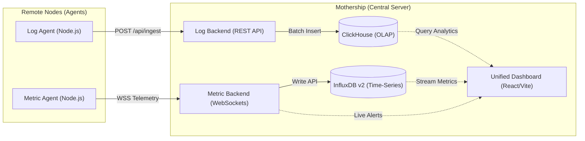

# Logs-Monitoring-Mookit: End-to-End System Documentation


**Logs-Monitoring-Mookit** is a unified, centralized, and highly scalable stack designed to natively monitor both the **System Health (Metrics)** and **Application Traffic (Logs)** of distributed servers through a premium React/Vite dashboard.

## Table of Contents
1. [Architecture & Design Choices](#1-architecture--design-choices)
2. [Quick Installation](#2-quick-installation)
3. [Configuration Guide](#3-configuration-guide)
4. [Production Deployment](#4-production-deployment)
5. [Security & Analytics Capabilities](#5-security--analytics-capabilities)
6. [Future Works](#6-future-works)

---

## 1. Architecture & Design Choices

Before deploying, it helps to understand the system dependencies and flow. The architecture is split into two specialized pipelines that converge into a unified dashboard.


```mermaid
flowchart LR
    subgraph "Remote Nodes (Agents)"
        LA["Log Agent (Node.js)"]
        MA["Metric Agent (Node.js)"]
    end

    subgraph "Mothership (Central Server)"
        LB["Log Backend (REST API)"]
        MB["Metric Backend (WebSockets)"]
        
        DB1[("ClickHouse (OLAP)")]
        DB2[("InfluxDB v2 (Time-Series)")]
        
        UI["Unified Dashboard (React/Vite)"]
    end

    LA -- "POST /api/ingest" --> LB
    LB -- "Batch Insert" --> DB1
    
    MA -- "WSS Telemetry" --> MB
    MB -- "Write API" --> DB2
    
    DB1 -. "Query Analytics" .-> UI
    DB2 -. "Stream Metrics" .-> UI
    MB -. "Live Alerts" .-> UI
```

### A. The Log Analytics Pipeline
**Goal:** Track user requests, parse access logs natively, identify errors, and detect security threats seamlessly.
*   **The Log Agent (Node.js):** Sits on your remote application server. It tails logs, parses them strictly (Nginx Combined format or Custom App format), groups them into batches, compresses them, and sends them to the central server.
*   **The Log Backend (Node.js + Express):** Validates incoming logs, runs Threat Detection (SQLi, XSS, Brute Forces), and natively pushes them into the database.
*   **The Database (ClickHouse):** We utilize ClickHouse over Postgres because ClickHouse is an OLAP columnar database. It provides extremely high-performance query execution across millions of analytical log rows.

### B. The System Metrics Pipeline
**Goal:** Monitor CPU, RAM, Disk, and Service uptime, automatically routing critical email alerts if thresholds are exceeded.
*   **The Metric Agent (Node.js):** Deployed to target machines to asynchronously poll hardware and logical service statuses.
*   **The Metric Backend (Node.js + WebSockets):** Receives live telemetry data, tests against the internal Alert Engine algorithm, and routes telemetry directly to the frontend via WebSockets.
*   **The Database (InfluxDB v2):** InfluxDB is a Time-Series Database optimized explicitly for storage and aggregation of time-series metric snapshots.

---

## 2. Quick Installation

### Prerequisites
*   **Docker & Docker Compose** (for the databases)
*   **Node.js (v18+) & NPM** (for backend APIs and frontend builds)
*   **PM2** (`npm install -g pm2`)

### Step 1: Database Initialization
Use Docker to spin up the ClickHouse and InfluxDB instances:
```bash
docker compose up -d
```
*(Starts `clickhouse-server` on port 8123 and `influxdb:2` on port 8086)*

### Step 2: Initialize the Unified Stack
Initialize the application cluster using `pm2`:
```bash
npm install
cd backend && npm install && cd ..
cd frontend && npm install && cd ..
cd monitoring-server && npm install && cd ..
cd monitoring-agent && npm install && cd ..
cd agent && npm install && cd ..

pm2 start ecosystem.config.js
pm2 save
```

### Step 3: Access the Interface
Navigate to **http://localhost:5173**

---

## 3. Configuration Guide

System configurations are driven entirely by environment variables. 

### A. Master Config (`backend/.env`)
The unified backends rely on this primary configuration.
```ini
# CORE SERVER
PORT=5002                        
HOST=0.0.0.0                     

# DATABASE: CLICKHOUSE
CLICKHOUSE_HOST=http://localhost:8123
CLICKHOUSE_DATABASE=logs
CLICKHOUSE_USER=default
CLICKHOUSE_PASSWORD=login123

# EMAIL ALERTS
SMTP_HOST=smtp.gmail.com         
SMTP_PORT=587                    
SMTP_SECURE=false                
SMTP_USER=alerts@yourdomain.com  
SMTP_PASS="app_specific_password" 
ADMIN_EMAILS=admin@yourdomain.com 

# AUTHENTICATION
LDAP_URL=ldap://ldap.example.com:389  
LDAP_BASE_DN=ou=People,dc=example
JWT_SECRET=super-secret-key           
```

### B. Frontend Interface (`frontend/.env`)
Vite builds require static IPs at compile time. Replace `localhost` with the server's public IP address or FQDN.
```ini
VITE_API_BASE_URL=http://<SERVER_IP>:5002   
VITE_SERVER_URL=http://<SERVER_IP>:5000     
```

### C. Central Metric Server (`monitoring-server/.env`)
Automatically inherits `backend/.env`. Inherited defaults:
```ini
DATABASE_TYPE=influxdb
INFLUXDB_HOST=http://localhost:8086
INFLUXDB_TOKEN=my-super-secret-auth-token  
INFLUXDB_ORG=monitoring-org
INFLUXDB_BUCKET=monitoring
```

### D. Remote Nodes (`agents`)
Configured to point to the central monitoring server.
**Metrics** (`monitoring-agent/config.json`): `server_url: "http://<CENTRAL_IP>:5000"`
**Logs** (`agent/.env`): `BACKEND_URL=http://<CENTRAL_IP>:5002/api/ingest`

---

## 4. Deployment Guides

The system features two distinct deployment pathways depending on your environment. 

### 1. Production Deployment (Nginx + Docker)
The `docker-compose.yml` file is tailored for production stability. It orchestrates the databases and backend APIs, and statically builds the frontend to be served efficiently via an **Nginx** web server natively bound to **Port 80**.

1. **Configure Environment:** Modify `frontend/.env` to reflect your server's public IP address. Populate `backend/.env` with your production SMTP and LDAP credentials.
2. **Launch Stack:** 
   ```bash
   docker compose up -d --build
   ```
3. **Access:** Navigate to `http://<YOUR_SERVER_IP>` (No port needed, defaults to 80).

### 2. Development Deployment (PM2 + Vite)
For active development or rapid debugging, host the Node.js APIs natively on your OS via PM2, while keeping the databases containerized. In this mode, the frontend uses the active **Vite Dev Server** bound to **Port 5173**.

1. **Start Databases:** `docker compose up -d clickhouse influxdb`
2. **Install Dependencies:** Execute `npm install` within all sub-directories.
3. **Start PM2:** `pm2 start ecosystem.config.js && pm2 save`
4. **Access:** Navigate to `http://localhost:5173`.

### Port & Firewall Guidelines
Ensure inbound TCP traffic allows the following ingress connections globally or from trusted networks:
- **Port 80/443**: Nginx Production Web Traffic 
- **Port 5173**: Vite Active Development Traffic
- **Port 5000**: Metrics WebSocket Streaming Server
- **Port 5002**: REST API Endpoints & Log Ingestion

---

## 5. Security & Analytics Capabilities

- **Database Partitioning Strategy**: ClickHouse partitions table sets strictly by `(vmId, app, toYYYYMM(timestamp))`. This guarantees isolated tenant access and provides immediate directory-layer capability for data purges (Drop Partition).
- **Automated Threat Detection**: Scheduled algorithms parse ingested logs for high-frequency 401/403 errors (Brute force), SQLi commands, XSS payloads, and Path Traversal attempts.
- **Alert Debouncing**: The analytical backend aggregates synchronous critical service failures into simplified batched event summaries to mitigate notification fatigue.

---

## 6. Future Works

To make this system even more capable, here is the current roadmap for upcoming features:

*   **Log & Metric Correlation**: Connecting the metric timeline directly to the log explorer for single-click investigation. 
*   **Auto-Remediation / Self-Healing**: Utilizing the agents to execute predefined bash restart scripts when services shift to `DOWN` states.
*   **Modern Notification Integrations**: Webhooks designed to push rich alerts into Slack, Microsoft Teams, and Discord.
*   **Log-Derived Dashboards**: Creating frontend visual panels dynamically based on extracted Log text (e.g., Error Rates, Traffic Maps).
*   **Centralized Agent Updates**: Updating remote collector scripts seamlessly via the mothership interface without explicit SSH iteration across clusters.
